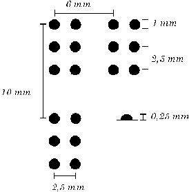

# BR-AI-LLE
Building AI course project

# Project Title

Final project for the Building AI course: BR-AI-LLE

## Summary

Tactile interpretation of Braille signs, used by visually impaired persons using the fingertips, for machine-based reading of such texts, used e.g. for training humans to learn to read such characters. 

Using a tactile sensor to collect data from  Braille signs and translate to characters in the computer. Since the sensor is under development, using computer generated patterns (images) of the matrix of dots with irregularities, noise, rotation, etc. AI will used for the recognition of characters.

## Background

Braille is the primary medium of written communication for persons who are visually impaired. It is read by tactile sensing in the finger tips of the persons. It can be read either on embossed paper or by using refreshable braille displays that connect to computers and smartphone devices. Braille can be written using a slate and stylus, a braille writer, an electronic braille notetaker or with the use of a computer connected to a braille embosser

A high-resolution tactile sensor on flexible substrate (e-skin) is being developed at Uppsala University Sweden, with resolution similar to the tactile resolution of human finger tips, about one sensor point, taxel, per millimeter).

One possible application that needs data processing and interpretation of the taxel information is identification of tactile Braille signs and translation to characters in the computer. The process to read with the finger tips is not simple and can take a long time to learn. There are computer-based generators of mechanical patterns that human can read, but a reading tool for existing texts would be very useful, especially in the learning process or for elderly people with reduce tactile sensing. As pointed out at mtm.se (see link at the end), the resources for teaching Braille are very limited, especially on human resources, so any tool that could ease the learning process is useful.

Pattern recognition using AI-based methods may provide robust solution when reading actual "mechanical" signs (usually deformation of printed paper), since there may be variation of size, height, quality and rotation of the characters.

In Sweden, around 1200 persons can read Braille, but many more could learn it if not limited by e.g. teaching resources. The same character set (with variants) are used around the world and thus not limited to a certain country or culture region.

Problems to be solved:

1. Selection of starting machine learning method.
To identify and translate the patterns (basically a 2 x 3 matrix of dots with size and separation in the millimeter scale, AI-based pattern recognition will be needed. 
Since the Braille matrix consists of only 2 x 3 dots per character (some special written characters use two Braille characters), a rather simple and non-complicated ML-method, similar to images recognition problems such as identifying handwriting, could be a good start to find a method with a good balance between accuracy and complexity. 

2. Obtaining material for training and testing.
Since the e-skin (the tactile sensor) is under development, using computer generated patterns (images) of the matrix of dots with irregularities, noise, rotation, etc., for training and testing of characters are needed. 

3. Training, testing, verifying selected ML method.

4. Suggestion for improvements.

## How is it used?

The solution is used to translate characters, and thus written text, from a Braille pattern (in the form of a image or pattern from an actual tactile sensor), to a computer-generated text on a computer screen or a special integrated reading device (sensor, interpretation of characters, display).
This project concentrates on using computer-generated images for training and testing.
The problem and solution has similarities with methods working with the MNIST image collection for handwriting identification of handwritten numbers.

The Braille pattern typically look like this:

## Data sources and AI methods

As previously discussed, since the e-skin (the tactile sensor) is under development, using computer generated patterns (images) of the matrix of dots with irregularities, noise, rotation, etc. for training and testing of characters are needed. 

So in order to train and test this systems, we need a data set. I did a quick search on internet, there are scientific and project presentation which use jphoto images as input, but no larger publically available data set [Gonçalves]

## Challenges

I guess the challenge is to making the solution not too complex. so it can operate on smaller devices with limited resources, if building an integrated sensor, pattern recognition, display unit, as discussed above.
 
Also, getting access to (creating) a dataset is a major startup work.

## Sources

 [Wikipedia: Braille](https://en.wikipedia.org/wiki/Brailleses/by/2.0)
 [Gonçalves] (https://doi.org/10.5753/wvc.2020.13492)
